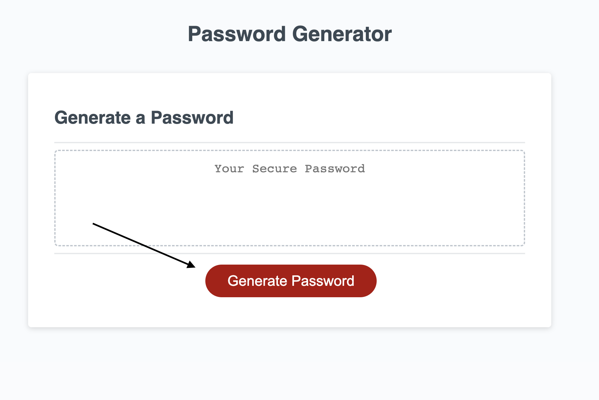
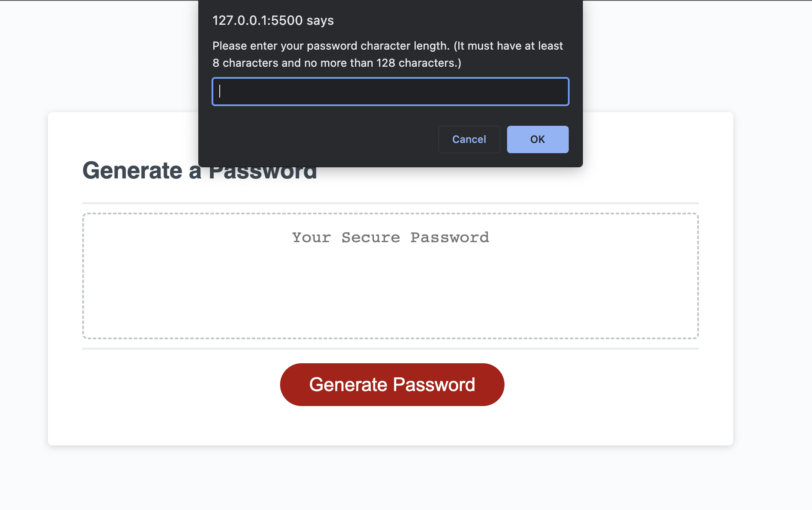
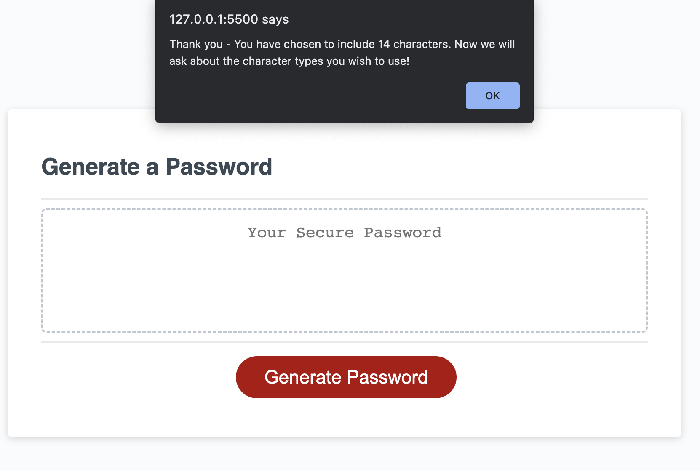
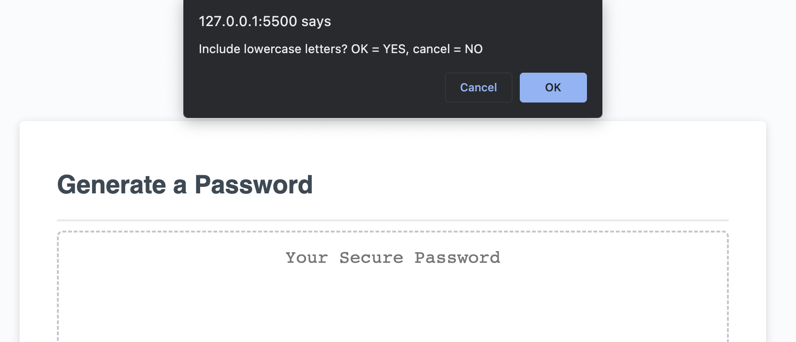
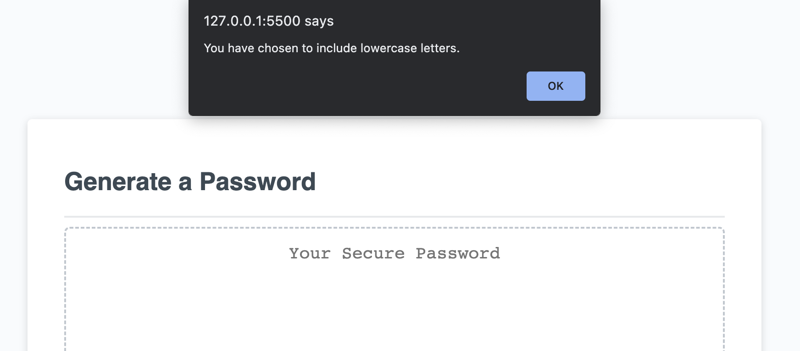
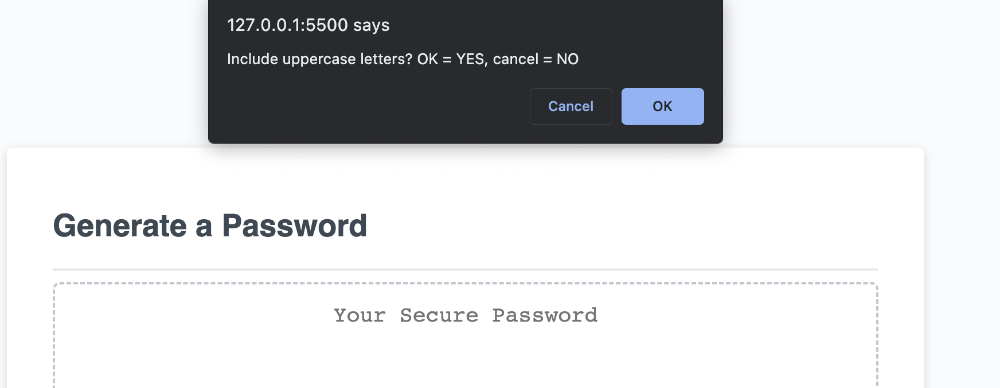
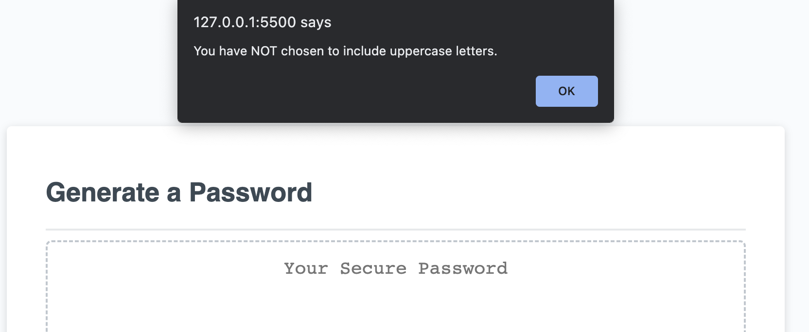
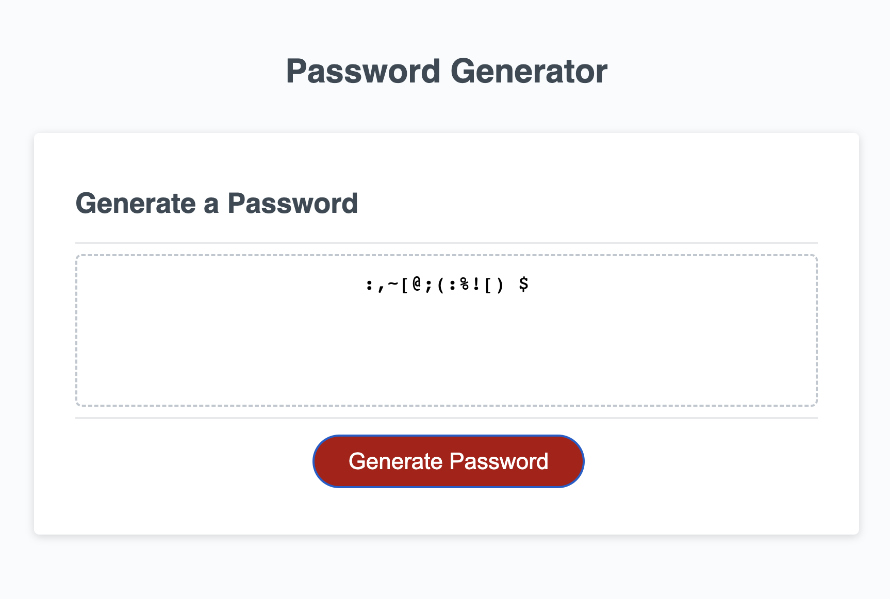

# 03 JavaScript: Password Generator

## Description

Provide a short description explaining the what, why, and how of your project. Use the following questions as a guide:

- What was your motivation?
This project was a learning tool used to introduce me to JavaScript logic. The simple task of generating a random password requires a good amount of logic in the code to work, especially when users should be able to choose the character types used and the length of the password. 

This generator will guide the user through a few easy steps so that they can get a randomly generated password. This is for users who can't think of a good, secure password. 

During this project, I learned a lot about using "if" statements in particular. 

## Table of Contents 

- [Usage](#usage)
- [Credits](#credits)
- [License](#license)

## Usage

Instructions: 

This simple generator guides the user through a set of prompts, logging user choices with each. Then, based on user choices, a password is generated and displayed to the User.

Photos:

## Credits

Prompt: 
https://www.bitdegree.org/learn/javascript-prompt
https://javascript.plainenglish.io/what-are-javascript-prompts-4a2dae6e08de

Confirm:
https://sabe.io/blog/javascript-yes-no-confirmation-box#:~:text=The%20best%20way%20to%20create,Ok%20and%20a%20Cancel%20button.

Random Password generator:
https://dev.to/code_mystery/random-password-generator-using-javascript-6a
https://www.geeksforgeeks.org/how-to-generate-a-random-password-using-javascript/

Syntax:
https://developer.mozilla.org/en-US/docs/Web/JavaScript/Reference/Operators/Logical_OR

## License

MIT License

Copyright (c) [2023] [Andrew Nalley]

Permission is hereby granted, free of charge, to any person obtaining a copy
of this software and associated documentation files (the "Software"), to deal
in the Software without restriction, including without limitation the rights
to use, copy, modify, merge, publish, distribute, sublicense, and/or sell
copies of the Software, and to permit persons to whom the Software is
furnished to do so, subject to the following conditions:

The above copyright notice and this permission notice shall be included in all
copies or substantial portions of the Software.

THE SOFTWARE IS PROVIDED "AS IS", WITHOUT WARRANTY OF ANY KIND, EXPRESS OR
IMPLIED, INCLUDING BUT NOT LIMITED TO THE WARRANTIES OF MERCHANTABILITY,
FITNESS FOR A PARTICULAR PURPOSE AND NONINFRINGEMENT. IN NO EVENT SHALL THE
AUTHORS OR COPYRIGHT HOLDERS BE LIABLE FOR ANY CLAIM, DAMAGES OR OTHER
LIABILITY, WHETHER IN AN ACTION OF CONTRACT, TORT OR OTHERWISE, ARISING FROM,
OUT OF OR IN CONNECTION WITH THE SOFTWARE OR THE USE OR OTHER DEALINGS IN THE
SOFTWARE.

---

## How to Contribute

Please see the [Contributor Covenant](https://www.contributor-covenant.org/) 

## Tests

Try to pick a password length greater or less than the mentioned length. Try not to choose any character type and see what happens. 
